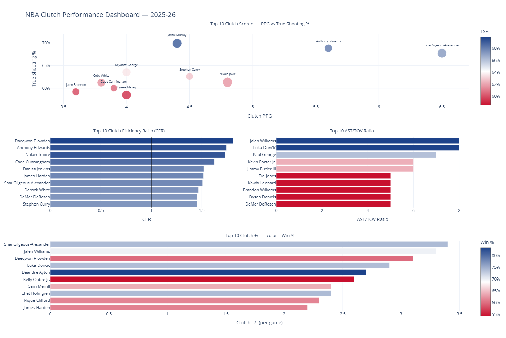
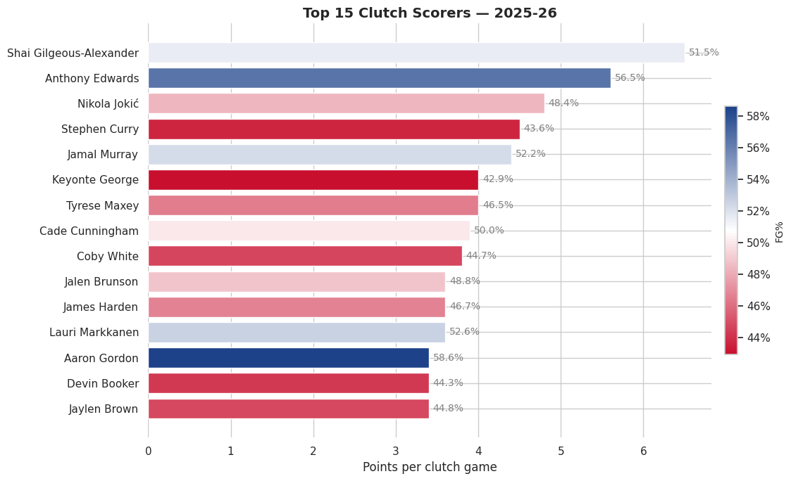
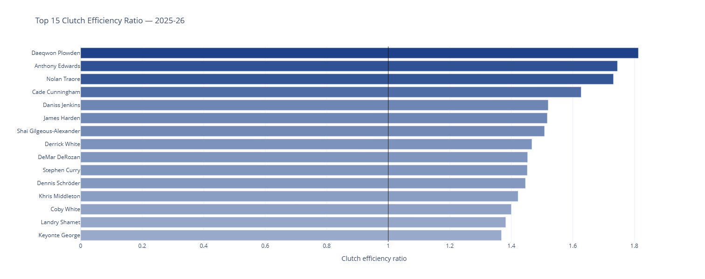
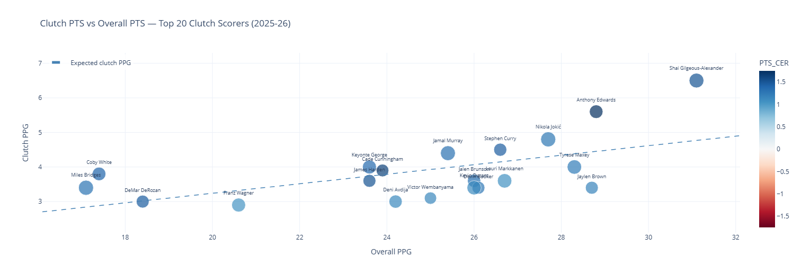

# NBA Clutch Performance Dashboard

> Who actually rises when the game is on the line — and who quietly shrinks?

An exploratory data project that pulls player-level **clutch** stats straight from the NBA Stats API, builds a few custom efficiency metrics, and turns it all into a set of static charts plus an interactive multi-panel dashboard.

**[Live demo →](https://alejandrommunizc.github.io/nba-clutch-dashboard/)**

<p>
  <a href="https://alejandrommunizc.github.io/nba-clutch-dashboard/"></a>
  
  
  
  
  
</p>

---

## What is "clutch"?

The NBA defines **clutch time** as the **last 5 minutes of the 4th quarter (or overtime)** when the score differential is **5 points or fewer**. Those are the possessions that decide games — and they're where reputations are made and broken.

This project asks three questions:

1. **Who scores the most in clutch?**
2. **Who scores the most _efficiently_ in clutch?**
3. **Who actually _elevates_ their game compared to the rest of the season?**

## The interactive dashboard

The notebook produces a standalone HTML dashboard combining the four headline views — top clutch scorers (with TS%), Clutch Efficiency Ratio, AST/TOV ratio, and clutch +/- — all in one shareable file.



> Open the live version: [alejandrommunizc.github.io/nba-clutch-dashboard](https://alejandrommunizc.github.io/nba-clutch-dashboard/) (hover for tooltips, zoom, etc.) — or browse the raw file at [`outputs/nba_clutch_dashboard.html`](outputs/nba_clutch_dashboard.html).

## Headline views

### Top 15 clutch scorers

Bars sorted by clutch points per game; color encodes FG% in those same possessions, so you can see at a glance which scorers are also efficient.



### Clutch Efficiency Ratio (CER)

A player averaging 30 PPG who scores 4 PPG in clutch isn't necessarily a better clutch performer than someone averaging 16 PPG who also scores 4 in clutch — the second player is scoring at a much higher _rate_ when it matters. CER fixes that:

```
CER = (clutch points / clutch minutes) / (overall points / overall minutes)
```

CER **> 1.0** means a player scores at a higher rate in clutch than during the rest of the game. **< 1.0** means they cool off.



### Clutch vs Overall scoring

The dashed line is the expected clutch PPG given a player's overall PPG (linear fit). Players above the line are out-performing the trend; players below it are under-performing it. Color = CER, so blue dots are the real elevators.



---

## Repo structure

```
nba-clutch-dashboard/
├── nba_clutch_dashboard.ipynb   # main notebook — full analysis end to end
├── requirements.txt             # minimal dependencies
├── index.html                   # GitHub Pages landing page
├── .nojekyll                    # tells Pages not to run Jekyll
├── assets/                      # screenshots used in this README + landing page
├── outputs/                     # generated charts (PNG + interactive HTML)
│   ├── nba_clutch_dashboard.html        # combined multi-panel dashboard
│   ├── clutch_efficiency_ratio.html     # interactive CER bar chart
│   ├── clutch_vs_overall_ppm_scatter.html
│   ├── top_clutch_scorers.png
│   ├── clutch_true_shooting.png
│   ├── clutch_plus_minus.png
│   ├── clutch_ast_tov_ratio.png
│   └── clutch_scorers_ast_tov.png
└── data/
    └── nba_clutch_stats.csv     # cleaned, merged dataset exported by the notebook
```

## How to run

```bash
# 1. Clone
git clone https://github.com/<your-user>/nba-clutch-dashboard.git
cd nba-clutch-dashboard

# 2. (Optional but recommended) create a virtual environment
python -m venv venv
# Windows
venv\Scripts\activate
# macOS / Linux
source venv/bin/activate

# 3. Install dependencies
pip install -r requirements.txt

# 4. Open the notebook
jupyter notebook nba_clutch_dashboard.ipynb
# …or open it in VS Code and pick the venv as the kernel
```

Running all cells will refresh the dataset from the live NBA Stats API and regenerate everything in `outputs/` and `data/`.

> **Tip:** change `SEASON = '2025-26'` at the top of section 2 to look at a different season.

## Methodology, in short

1. **Pull** two datasets from `nba_api`: per-game clutch stats and per-game overall stats.
2. **Filter** to players with at least **3 clutch MPG** and **10 clutch games** so the sample is meaningful.
3. **Engineer** a few metrics on top of the raw API:
   - `TRUE_SHOOTING` — `PTS / (2 · (FGA + 0.44 · FTA))`
   - `AST_TOV_RATIO` — ball security under pressure
   - `CLUTCH_PPM` / `OVR_PPM` — points per minute, clutch vs. season-wide
   - `PTS_CER` — the Clutch Efficiency Ratio defined above
4. **Visualize** with Seaborn/Matplotlib for the static charts and Plotly for the interactive ones.
5. **Export** the cleaned, joined dataframe to `data/nba_clutch_stats.csv`.

## Findings (2025-26 snapshot)

- **Top clutch scorer:** Shai Gilgeous-Alexander — 6.5 PPG in clutch situations.
- **Most efficient shooter:** Jamal Murray — 70.6% TS% among players with meaningful clutch volume.
- **Best clutch +/-:** Shai Gilgeous-Alexander at +3.4 per game — Oklahoma City consistently wins the closing minutes with him on the floor.
- **Best ball security:** Shai Gilgeous-Alexander again, with a 2.67 AST/TOV ratio.
- **Biggest elevator (CER):** Anthony Edwards at **1.75** — he scores roughly **74% more points per minute** in clutch than during the rest of the game. The clearest sign of a player who actually raises his level when it counts.

## Limitations

- Clutch samples are small and high-variance — a few hot or cold nights can move the leaderboard noticeably.
- Plus/minus is a team statistic; it reflects teammates and opponents, not just the individual.
- Some heavy-clutch players are stuck on losing teams, which drags their +/- down regardless of how well they personally play.

## Possible next steps

- Add shot charts for the top clutch scorers.
- Compare clutch performance across multiple seasons.
- Build a composite "clutch score" combining scoring, efficiency, playmaking, and impact.
- Roll the same analysis up to the team level.

## Author

**Alejandro Magdiel Muniz Corona** — 2026
Data source: [`nba_api`](https://github.com/swar/nba_api)
